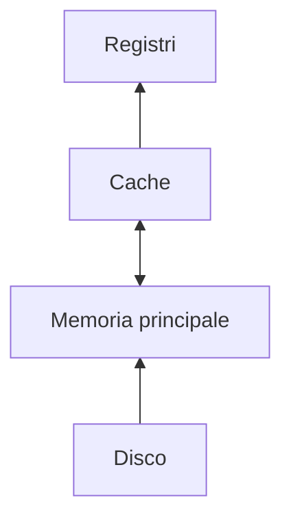

Una gerarchia di memoria è un sistema di [[memoria]] composto da più livelli, con aumento della velocità e riduzione delle dimensioni più si sale nella gerarchia.

>[!oss]
>Un livello può comunicare solo con i suoi adiacenti, la [[Cache]] è più piccola rispetto alla memoria principale
