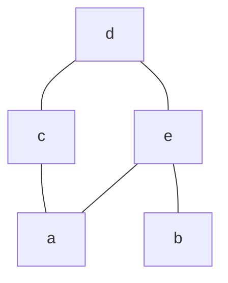
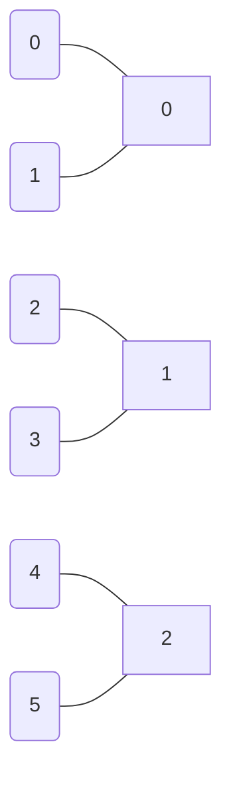

# 1
- Relazioni
	- matrice d'adiacenza
	- grafo di adiacenza
	- relazioni di equivalenza

# 2
- Relazioni
	- relazioni d'ordine

### 1.18

Data una [[relazione d'ordine]] su un insieme $A = \{ a,b,c,d,e \}$ tale che
$a \leq a, a \leq c, a \leq d, a \leq e$
$b \leq b, b \leq d, b \leq e$
$c \leq c, c \leq d$
$d \leq d$
$e \leq d, e \leq e$

è riflessiva, antisimmetrica e transitiva

disegniamo il [[diagramma di Hasse]]

$x$ minimale se $y \leq x \implies x = y, \forall y$

'c' ed 'e' sicuramente non sono ne massimale ne minimale.
'b' non ha nessun elemento sotto di se, quindi è minimale
'a' non ha nessun elemento sotto di se, quindi è minimale
'd' non ha nessun elemento sopra, quindi è massimale

x è minimo se $x \leq y \forall y$.
Quindi 'a' e 'b' non sono minimi, infatti 'b' non è $\leq$ di 'c', mentre 'a' non è $\leq$ di 'b', quindi non è un minimo.
'd' invece è massimo per transitività. 

### 1.16
$R \subseteq \mathbb{N} \times \mathbb{N}$, $(n,m) \in R \iff n$ dispari e $\exists t \in \mathbb{N} \setminus \{ 0 \} \text{ pari } : n = m + t$
$S \subseteq \mathbb{N} \times \mathbb{N} : (n,m) \in S$ se $(n,m) \in R$ oppure $n = m$

- R
	- non seriale per $(1,m)$ che non appartiene mai alla relazione $1 = n + t$ impossibile
	- non riflessiva (irriflessiva in realtà)
	- non simmetrica, $t$ deve essere sempre maggiore di zero quindi non si può "tornare in dietro" 
	- è transitiva, infatti $(n,m), (m,k) \in R \implies n = m + a, m = k + b, \implies n = k + a + b \implies n = k + \underbrace{ (a + b) }_{ pari }$ 

La domanda è se $S$ è la chiusura d'ordine di R.

S
- Seriale
- Riflessiva[^1]
- transitività[^1] (analogo)
- antisimmetrica[^1]

[^1]: quindi è relazione d'ordine

### 1.22

$$f(n) = \begin{cases}
\frac{n}{2} & n \text{ pari} \\
\frac{n-1}{2}  & n \text{ dispari}
\end{cases} $$

Chiaramente non ineittiva
$g$ inversa sinistra

$g \circ f(x) = x$

$\bar{g} \cdot f(n) = f(2n + 1) = \frac{2n + 1 - 1}{2}$

$\ker(f)$ è una relazione sul dominio, quindi $\ker(f) \subseteq \mathbb{N}$

$(n,m) \in  \ker(f)$ se $f(n) = f(m)$

$\ker(f) = \{(2k, 2k+1), (2k+1,2k) | \forall k \in \mathbb{N}\}$

È chiaramente una relazione d'equivalenza, facciamo quindi il quoziente:
$$\frac{\mathbb{N}}{\ker(f)} = \{ \{ 0,1 \}, \{ 2,3 \}, \{ 4,5 \},\dots \} = \{ (2k, 2k+1) | \forall k \in \mathbb{N} \}$$

### 1.25
Quali relazioni sono funzioni e se sono funzioni sono iniettive e suriettive
$R_{1} = \left\{  (x,y) \in \mathbb{R} \times \mathbb{Z} | y = \frac{2}{3}x + 1  \right\}$

Non una funzione in quanto non è seriale, infatti per molti vlaori non vi è un valore corrispondente in $\mathbb{Z}$

$R_{2} = \{ (x,y) \in \mathbb{N} \times \mathbb{Z} : |y| = 2x \}$
$x = \frac{|y|}{2}$
- seriale

Non è una funzione però, ad esempio per $x = 5$ ha corrispondenti $10$ e $-10$