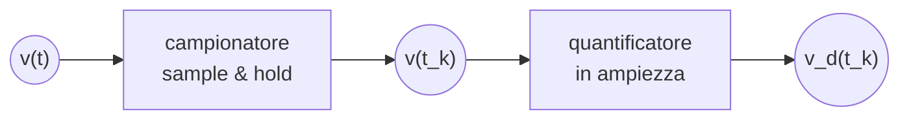

Col campionatore sample & hold abbiamo la discretizzazione nel tempo
Col quantizzatore in ampiezza c'è una discretizzazinoe in ampiezza

>[!remark]
>Sempre in quest'ordine!

##### Discretizzazione nel tempo
Il segnale campionato si ottiene idealmente prelevando campioni in un tempo infinitesimo, in realtà occorre un tempo finito $(T_{W}) \neq 0$ per prelevare da $v(t)$ il segnale campionato $v(t_{k})$ e per quantizzarlo

>[!example]
>Un segnale di tensione $v(t) = x(t)$ è reale e continuo.
>
>Ipotizziamo di lavorare con uno spettro del segnale limitato: trasformata $X(f)$ tale che $X(f) = 0$ per $|f| = f_{\max}$
>
>Se il segnale non ha una banda limitata a $f_{\max}$ possiamo usare un filtro passa basso.
>
>In un [[campionamento ideale]] il segnale è moltiplicato per un treno di [[delta di dirac]] $h(t) = \delta(t)$. 
>
>In un [[campionamento reale]] il segnale è moltiplicato per un treno di rettangoli $h(t) = \text{rect}(t / T_{w})$ in cui il singolo rettangolo ha durata finita $T_{W}$

# Statistica

### Campionamento da una popolazione finita
Consideriamo una popolazione di $N$ elementi, dove $p$ è la percentuale di popolazione che ha una certa caratteristica.
Presi $n$ elementi da questa popolazione, definiamo un [[campionamento casuale]].
Scelto un campione di dimensione $n$ da una popolazione di dimensione $N$ definiamo, per $i=1,\dots,n$
$$ X_{i} = \begin{cases}
1&\text{se } i \text{ ha la caratteristica} \\
0&\text{altrimenti}
\end{cases} $$
La somma di questi termini
$$X=X_{1} + X_{2} + \dots + X_{n}$$
ha valore uguale al numero di campioni che hanno la caratteristica indagata, inoltre
$$ \bar{X} = \frac{X}{n} $$
è uguale alla percentuale del campione scelto che ha quella caratteristica.
Consideriamo le probabilità associate ad $X$ e ad $\bar{X}$. Notiamo intanto che ognuno degli $N$ membri della popolazione ha la stessa probabilità di essere l'$i$-esimo membro del campione.
$$ P \{ X_{i} = 1 \} = \frac{Np}{N} = p $$
e allo stesso modo possiamo osservare
$$ P\{ X_{i} = 0 \} = (1-p) $$

>[!remark]
>Notiamo come le [[Variabile aleatoria|variabili aleatorie]] $X_{i}$ non sono tra loro indipendenti. Infatti se sappiamo che una di esse è nel campione, la probabilità che una qualsiasi delle altre lo sia diminuisce