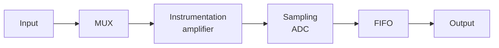

- [[MUX|multiplexer]] - permette di selezionare i diversi ingressi disponibili di tipo **single ended** e di tipo **differenziali**
- [[amplificatore per strumentazione]] - amplifica o attenua il segnale in ingresso mantenendo la stessa amplificazione/attenuazione a prescindere dalla frequenza del segnale d'ingresso (in base alla banda della scheda)
- [[campionatore ADC]] - convertitore analogico digitale che converte la tensione in un valore numerico (bit)
- Memoria FIFO - first in first out invia o sul bus dati del PC o direttamente in RAM (tramite DMA) del PC.

Inoltre hanno opzionalmente delle uscite analogica (DAC) di linee di I/O e di sincronizzazioni analogiche e digitali (timer e trigger)

## Parametri
### Modalità di acquisizione
Le schede daq hanno due modalità di acquizone, queste modalità sono globali (non si può acquisire un segnale in SE ed uno in differenziale) ed in particolare un singolo segnale in differenziale forzerà tutta la scheda in differenziale (il default è single-ended)
#### Modalità single-ended
Il segnale ha come riferimento la massa interna della scheda, condivisa con tutti i segnali. In modalità single ended si occupa un canale per segnale

#### Modalità differenziale
Ogni segnale ha come riferimento una propria tensione, e l'acquisizione è data quindi da una differenza di potenziale esterna. Si annullano i disturbi presenti su entrambi i canali
- ✅**vantaggi**: Si annualano i disturbi presenti su entrambi i riferimenti di tensione
- ❎**svantaggi**: necessario occupare due canali in ingresso. 

>[!esempio]
>batterie richiedono modalità differenziale.
>una termocoppia richiede modalità differenziale.

### Frequenza di campionamento
Indica la frequenza massima **per un singolo segnale**!
Se dobbiamo lavorare con più segnali dobbiamo dividere per il numero di segnali
$$ f_{samp,max} = \frac{f_{max,ADC}}{N_{segnali}} $$

>[!danger]
>Numero di segnali, non di canali! Quindi non importa se la modalità di acquisizione è single-ended o differenziale

### Dinamica ADC e guadagno
La dinamica ADC indica la differenza di tensione massima con cui può lavorare la scheda, questo è un parametro fisso di ogni scheda, se vogliamo lavorare con segnali di ordini maggiori o minori della dinamica offerta dobbiamo sfruttare il guadagno, che moltiplicheremo al potenziale
$$ G = \frac{D_{ADC}}{D_{segnale}} $$

I guadagni possibili sono tendenzialmente preimpostati, e sono applicabili ad ogni segnale separatamente.

>[!esempio] Una scheda può avere valori possibili di guadagni: `[G = 100, g = 10, G = 1, G = 0.5]`

### Risoluzione dell'ADC
Numero di bit che usa l'ADC
$$\Delta V = \frac{D_{ADC}}{G \cdot 2^n} \qquad \qquad \delta = \frac{1}{N} = \frac{1}{2^n}$$

- $N$ numero di livelli
- $n$ numero di bit