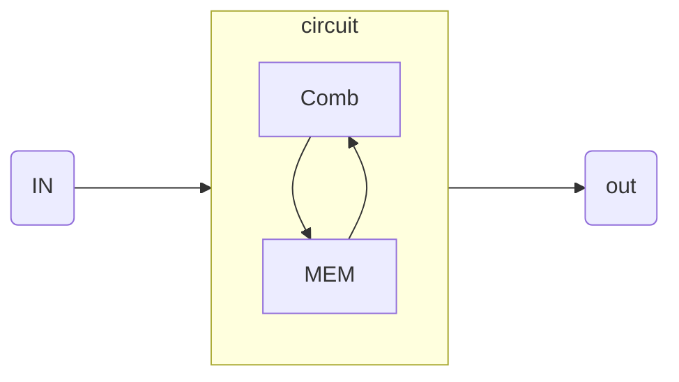

Nell'[[elettronica combinatoria]] $x \to f \to Y = f(x)$, non vi è elemento di memoria.

Nella logica sequenziale l'uscita è anche funzione dello stato del circuito



## Elementi di memoria

#### elementi di memoria più veloci (registri e cache L1, static RAM)
- [[latch]]
- [[flip flop]]

sono [[Bistabili]], hanno due punti di stabilità che indiano rispettivamente 0 e 1.

```tikz
\usepackage{circuitikz}
\begin{document}
\begin{tikzpicture}
\node[not port] (A) at (2.5,0){};
\node[not port,xscale=-1] (B) at (2.5,-2){};
\draw (0,0) to (A.in);
\draw (A.out) to (5,0);
\draw (B.in) -| (4,0);
\draw (B.out) -| (1,0);
\end{tikzpicture}
\end{document}
```

[[Bistabili#Bistabile SR asincrono]] detto anche #todo set reset e [[Bistabili#Bistabile $ overline{ text{SR}}$|bistabili !(SR)]]

Possiamo quindi definire i [[latch]].


Riassumendo

>[!definition]
>**Bistabile**: circuito che ha due punti di equilibrio stabile, che rappresentano 1 o 0
>**Latch**: Bistabile con un segnale di enable
>**Flip-Flop**: Latch con un clock come ingresso del segnale di enable


>[!tldr] flipflops
>- SR
>- SR negato
>- JK
>- D
>- T


Vi sono vari tipi di edge triggering (rising edge, falling edge, rise/fall, fall/rise).

[[cella SRAM]] 2 nmos, 2pmos, 2 transistor

[[pipeline]]