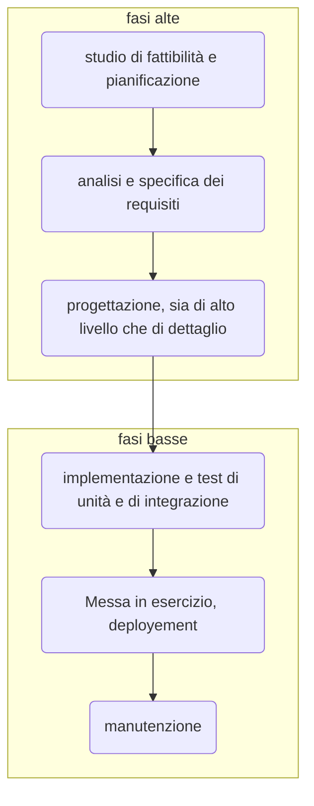

Il modello a cascata, proposto alla fine degli anni '60, è un modello che ha come l'obiettivo quello di istituire una "catena di montaggio" nello sviluppo del software.
Inizialmente si costituiscono dei livelli, composti da fasi e attività, si sceglie l'output di ciascuna fase e si decide un termine di ciascuna fase, che porta alla fase successiva della catena di montaggio; è impedito tornare all'indietro.

## Fasi alte

### Studio di fattibilità e pianificazione
In questa fase si inizia effettuando uno studio di fattibilità, si decide ossia se il progetto sia realizzabile con uno studio dei costi benefici, si controllano eventuali alternative e si studiano le risorse necessarie.

L'output è uno **studio di fattibilità**
- descrive il problema
- descrive possibili soluzioni
- fornisce costi, tempi e altri possibili dati per la soluzione considerata (ed alternative)

Una volta scelto che è utile continuare, si passa alla **pianificazione**, si progettano piani, ossia previsione di come gestire le attività, di:
- garanzia della qualità
- gestione di configurazioni
- manutenzione

### Analisi e specifica dei requisiti
Cosa vuole il cliente e come verrà fornito? ASR individua i requisiti caratteristici del software

L'output è una **specifica**, successivamente convalidata tramite analisi e verifiche.

La **specifica** indica cosa deve svolgere il software

>[!oss]
>dalla specifica derivano i casi di test

### Progettazione
Vuole definire l'architettura software, ossia i singoli componenti e come comunicano. Vuole farlo attraverso sviluppo parallelo e suddivisione della responsabilità. 

L'output è il **documento di progetto**, che descrive l'architettura complessiva e come i singoli moduli compongono il sistema

Da cui è possibile eseguire la [[decomposizione]] in [[moduli]]

## Fasi basse
### Codifica e test
Il software viene codificato tramite linguaggio di programmazione scelto, ogni modulo deve offrire la propria documentazione. In questa fase iniziano le prime verifiche cosidette statiche, ossia  verifiche di compilazione e di inizializzazione delle variabili. Si procede poi con
- [[test di unità]]
	- Si testano i moduli seaparatamente, fino a quando non si è certi della sua funzionalità
- [[test di integrazione]]
- [[test di sistema]]