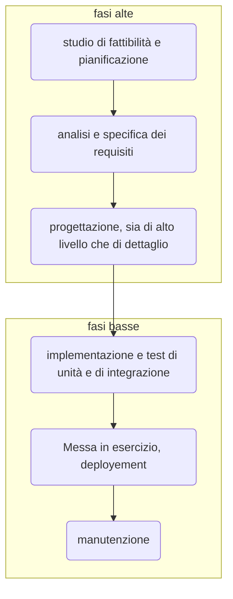

Il modello a cascata, proposto alla fine degli anni '60, è un modello che ha come l'obiettivo quello di istituire una "catena di montaggio" nello sviluppo del software.
Inizialmente si costituiscono dei livelli, composti da fasi e attività, si sceglie l'output di ciascuna fase e si decide un termine di ciascuna fase, che porta alla fase successiva della catena di montaggio; è impedito tornare all'indietro.

## Fasi alte

### ![[Studio di fattibilità e pianificazione]]

### ![[Analisi e specifica dei requisiti]]

### ![[Progettazione]]

## Fasi basse
### ![[Codifica e test]]

### ![[deployment]]

### ![[manutenzione]]

# Problemi del ciclo a cascata
- La manutenzione è finale, non disciplinata da un processo (non è divisa in attività fondamentali)
- Va comunque adattato ad ogni progetto
- Non è flessibile, è richiesto sapere tutto (dominio, requisiti determinati, stabilità dei requisiti)

Sarebbe utile coinvolgere gli utenti durante il ciclo di vita affinchè i requisiti possano essere interpretati nel modo più oggettivo possibile, ossia è necessaria [[trasparenza]]