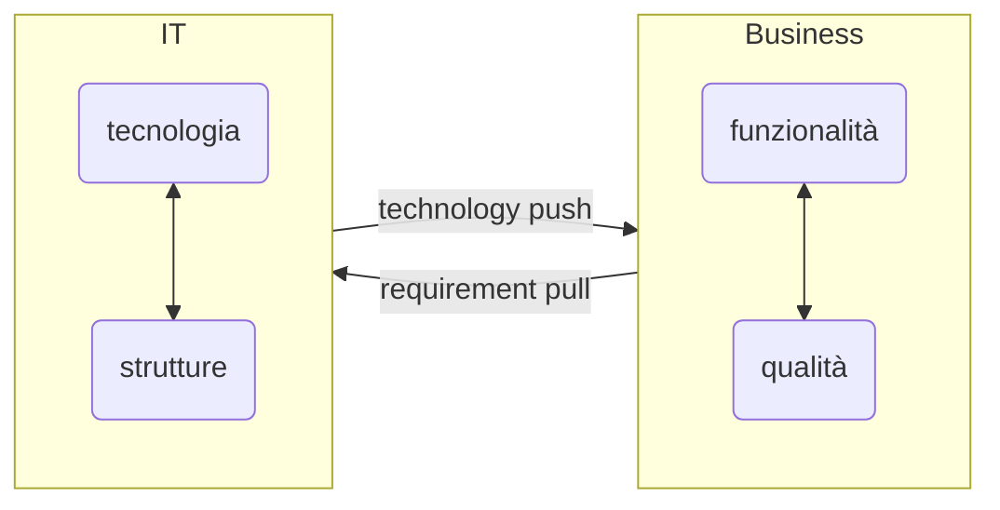

Significa architettura aziendale

> [!def]
> I [[sistemi informativi]] si sono evoluti come: sistemi distribuiti, collaborativi inter ed intra aziendali, inoltre il sistema informativo deve adattarsi al cambiamento senza dover rifare tutto da capo (requirements pull e technology push).
> Per gestire relazioni Business/TEcnologia progettiamo **strutture astratte** sfruttando il concetto di architettura (definizione ISO/IEC 42010)

### Architettura come base di progettazione

L'architettura fornisce tre diverse viste del sistema informativo
1. Statica - descrizione dei componenti hardware e software
2. dinamica - descirizione dei delle relazioni tra componenti
3. vista delle regole di progettazione e evoluzione del SI nel tempo

L'architettura è il punto di connessione tra BO e T nel [[BOAT]]

### Visione d'insieme della progettazione del sistema informativo
fig 2.11