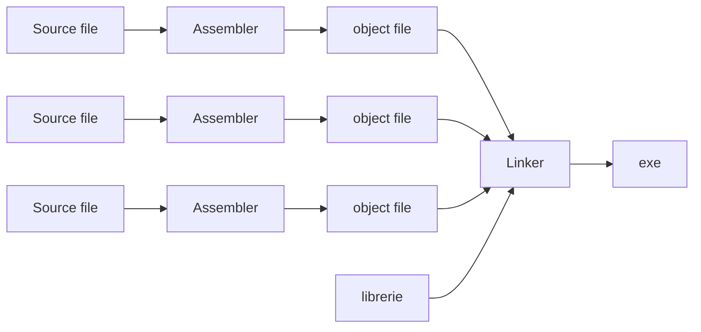

# Linker

Risolve le etichette e genera un codice binario, detto eseguibile, in formato rilocabile. È il livello successivo all'[[assembler]]

### Passo 1, determinazione della posizione in memoria dei moduli:
L'assemblatore alloca la sezione testo e la sezione dati a partire dall'indirizzo base 0 a passi di 4
I moduli devono essere caricati sequenzialmente, rispettando la struttura di [[memoria]]:

  Indirizzi alti| Base
 --- | ---
 dato del modulo B | 0x1000 0008
 dati del modulo MAIN | 0x1000 0000
 $\vdots$ | $\vdots$
 testo del modulo B | 0x0040 0014
 testo del modulo MAIN | 0x0040 0000
 **RESERVED** |0x0000 0000

### Passo 2, tabella dei simboli globale
È costituita dall'unione delle tabelle dei simboli dei moduli da collegare rilocati in base all'indirizzo base del modulo a cui appartengono:
$$\text{Indirizzo finale} = \text{indirizzo iniziale} + \text{indirizzo base modulo}$$

La tabella rispetto all'esempio visto nella parte di [[assembler]]

Simbolo | indirizzo iniziale | Indirizzo base di rilocazione del modulo | indirizzo finale (effettivo)
 --- | --- | --- | --- |
 MAIN| 0 | 0040 0000 | 0040 0000
 X | 0 | 1000 000 | 1000 0000
 B | 0 | 0040 0014| 0040 0014
 E | 10 | 0040 0014 | 0040 0024
 Y | 0 | 1000 0010 | 1000 0008

### Passo 3, correzione dei riferimenti nei moduli

Per questo passo introduciamo una nuova terminologia:
- ISTR si riferisce ad'un istruzione riferita dalla tabella di rilocazione di un modulo (M) con simbolo (S) e indirizzo IND.
- VS l'indirizzo rilocato di una istruzione ISTR riferita dalla tabella di rilocazione di un modulo M con simbolo VS = IND + BASE_M
- %pcrel (S) = delta_VS = VS - PC, cioè delta indirizzo effettivo dell'istruzione a cui si riferisce rispetto al [[program counter]].

Ora, in questo passo vanno applicate regole diverse in base al tipo di istruzioni:
- ISTR è in [[istruzioni#Formato J]]: inserire %pcrel (S)/2 su 20 bit, quindi $(VS-PC)/2$
- ISTR è in [[istruzioni#Formato B]]: inserire %pcrel (S)/2 su 12 bit, cioè $(VS-PC)/2$
- ISTR è in [[istruzioni#formato U]]:
	- Se `auipc` da espansione di `la` inserire: %pcrel_hi(S)
	- Se `lui` da espansione di `la` inserire: %hi(S)
- ISTR è in  [[istruzioni#Formato I]]
	- Se `addi` da espansione di `la` inserire: %pcrel_lo(S)
	- Se `addi` da espansione di `li` inserire: %lo(s)
