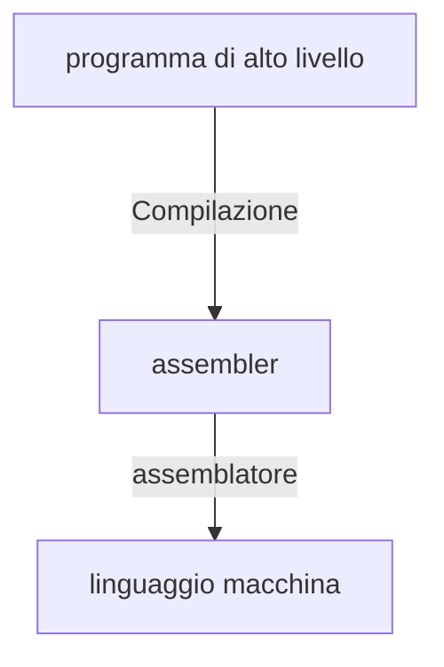
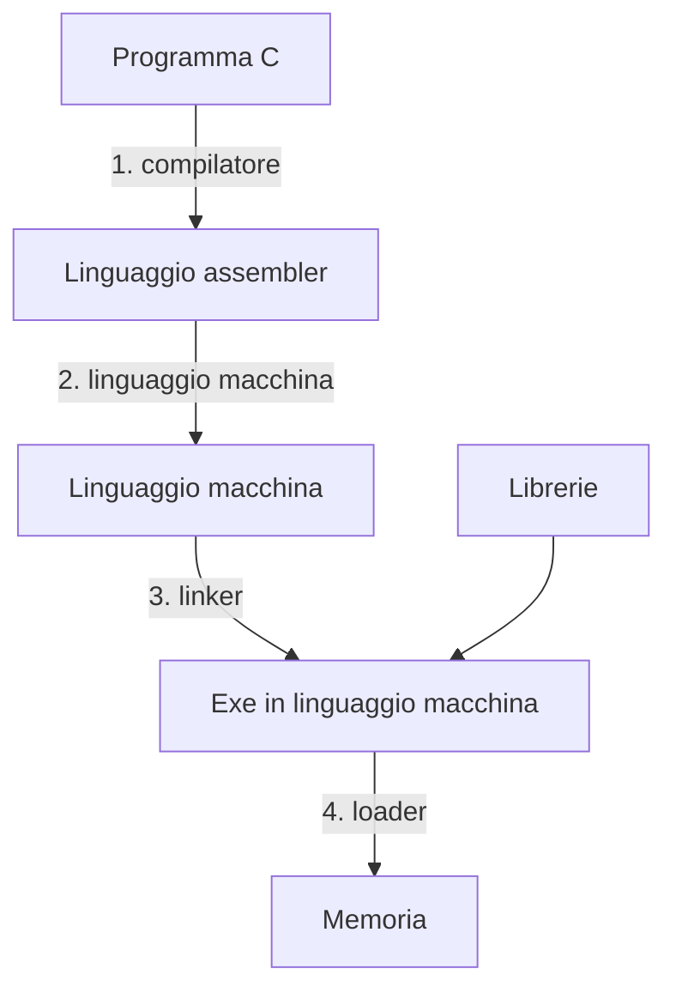

# livelli di astrazione

```mermaid
graph TD
	A[programma di alto livello] --->|Compilazione| B[assembler] -->|assemblatore| C[linguaggio macchina]
```

Con l'[[assembler]]

Un programma ha quindi 4 fasi prima di arrivare all'esecuzione:
1. compilazione

```mermaid
graph TD
	A[Programma C] -->|1. compilatore| B[Linguaggio assembler] -->|2. linguaggio macchina| C[Linguaggio macchina] -->|3. linker| D[Exe in linguaggio macchina] -->|4. loader| E[Memoria]
	Z[Librerie] --> D
```
