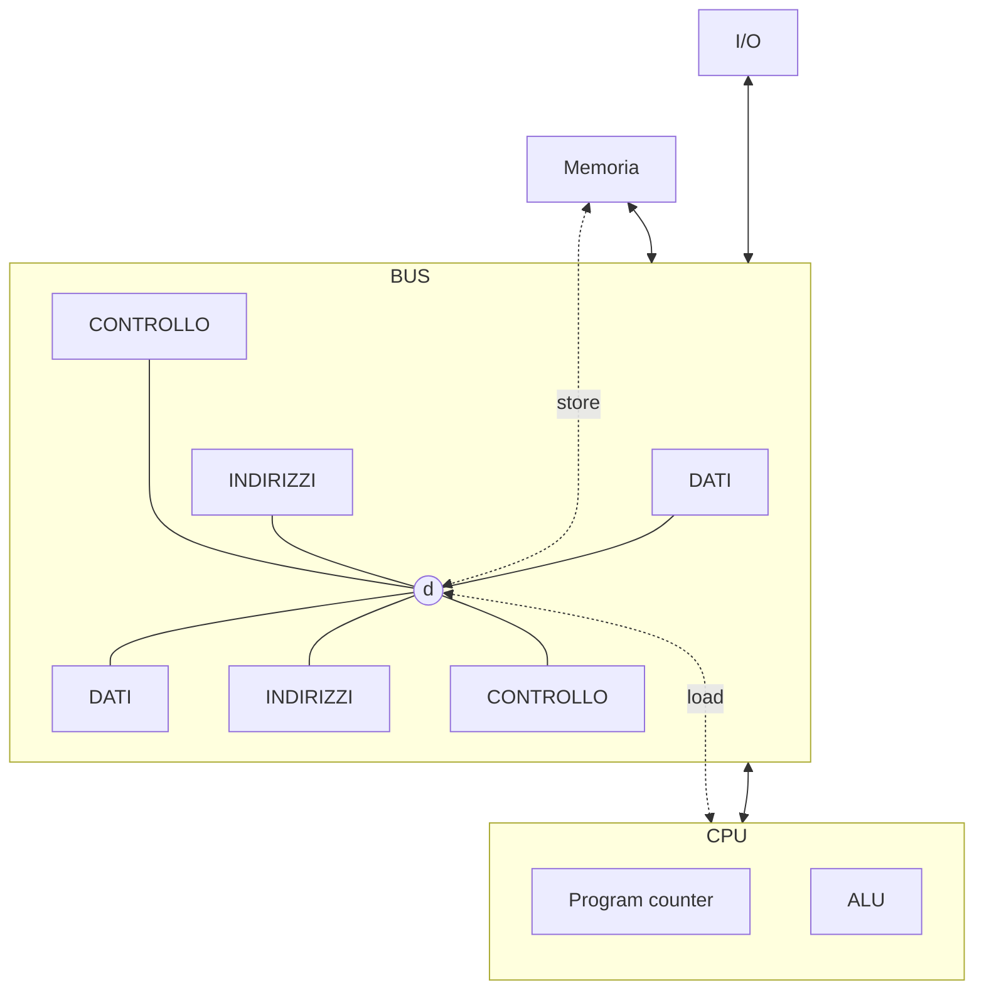

# Macchina di von neumann
Idealizzazione di un computer

```mermaid
flowchart TB
	subgraph CPU
	direction TB
		PC[Program counter]
		ALU
	end
	M[Memoria] <--> BUS
	I[I/O] <----> BUS
	subgraph BUS
	direction LR
	A[DATI] --- A1((d)) 
	C[INDIRIZZI] --- A1
	E[CONTROLLO] ---- A1
	A1 --- V[DATI]
	A1 --- D[INDIRIZZI]
	A1 --- N[CONTROLLO]
	end
	M <-...->|store| A1 <-..->|load| CPU
	BUS <----> CPU
```

I componenti chiave sono L'[[Unità aritmetico logica]], Il [[program counter]], la [[memoria]] ed il [[registro]]
