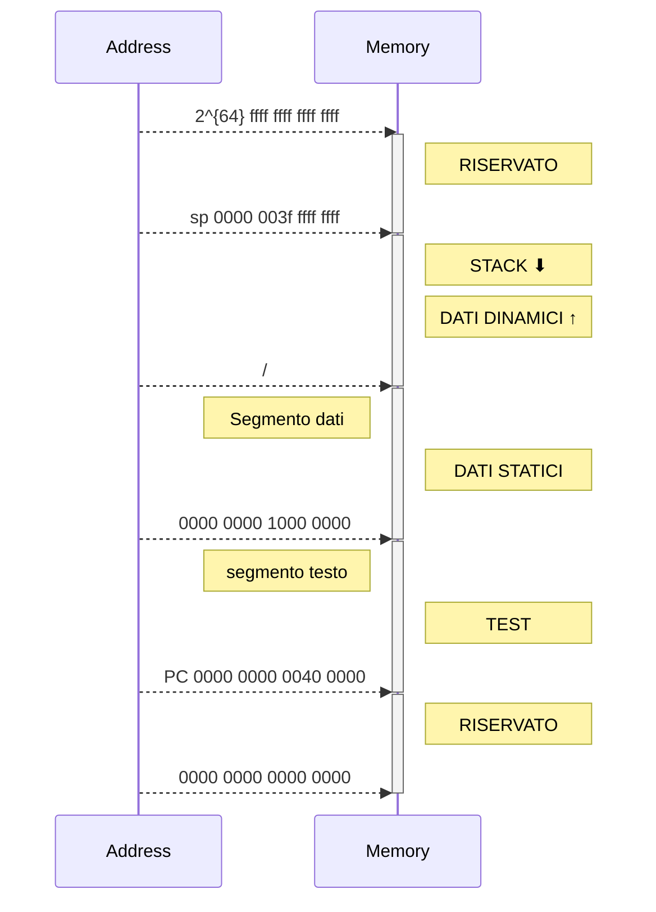

# Memoria
Memoria indirizzabile al singolo byte ed è divisa in parole:
 - Una parola $32$ bit contiene $4$ byte
 - Una parola doppia $64$ bit contiene $8$ byte

Gli indirizzi di memoria sono a 64 bit, espresso con indirizzamento a byte, e lo spazio di indirizzamento è di 16 exabyte ($2^{64}$ Byte).
Visto che le istruzioni occupano 32 bit hanno indirizzi allineati alla parola, multipli di 4 byte.

### Come assegnamo gli indirizzi ai byte?

>[!def] #### big endian
>
>...|...|...|...|indirizzo
>---|-|-|-|-|
>0|1|2|3|0
>4|5|6|7|4
>...|...|...|...|8
>Alla parola viene assegnato l'indirizzo del byte più significativo
>
0|1|2|3
-|-|-|-
0000 0000|0000 0000| 0000 0000 | 0000 0110


>[!def] #### little endian
>
>|...|...|...|...|indirizzo
>---|---|---|---|---
>3|2|1|0|0
>7|6|5|4|4
>...|...|...|...|8
>Alla parola viene assegnato l'indirizzo del byte meno significativo
>
>3|2|1|0
>-|-|-|-
>0000 0000|0000 0000| 0000 0000 | 0000 0110


La memoria può virtualmente (ossia massimo teorica) avere $2^{64}$ indirizzi




Area dati e area testo vengono dichiarate tramite direttive all'assemblatore: 

>[!multi-column]
>
>>[!clang]
>>```c
>>//variabili globali
>>int a
>>int b
>>...
>>
>>main()
>>{
>>//body
>>...
>>}
>>```
>
>>[!assembly]
>>```armasm
>>;0x0000 0000 1000 0000
>>.data
>>A: .word
>>B: .word
>>...
>>;0x0000 0000 0040 0000
>>.text
>>MAIN:
>>...
>>
>>;la stack non va dichiarata
>>```

>[!oss]
>Ricordiamo che le variabili all'interno della CPU sono nei [[registro|registri]], le variabili esterne alla CPU sono nella memoria.

## Dimensioni [[variabili]]

VAR | SIZE
 --- | ---
 `char` | 1 Byte
 `short int`| 2 Byte o 1 Half word
 `int` | 4 Byte o 1 word
 `long int`|8 Byte o una double word


# Indirizzo di memoria
Un'indirizzo di memoria è l'indirizzo che indica uno specifico blocco di memoria, un indirizzo di memoria di N bit è diviso in campi:
- Spiazzamento (offset) del byte nel blocco individua quale byte stiamo cercando
- Indice (index) identifica l'indirizzo del blocco in cache
- etichetta (tag) per confrontare il contenuto del campo etichetta del blocco di [[Cache]] selezionate dall'indice

# Memoria come [[Blocchi sequenziali|blocco sequenziale]]

- Memoria volatile, permette l'accesso in lettura e scrittura, ed ha una struttura a matrice le cui righe sono le parole di memoria a 32 bit con accesso direttiio


Un chip di memoria si caratterizza da:
- Capacità: numero di byte memorizzabili = numero di parole per 4 (ogni parola ha 4 byte)
- Funzioni: lettura e scrittura, solo lettura
- Numero di porte di accesso
- Tempo di accesso


Il contenuto è letto e scritto una parola per ciclo di [[clock]] e vi si accede attraverso un indirizzo fornito alla porta di accesso alla memoria, solitamente sia in scrittura che in lettura.

![[Pasted image 20221017180321.png]]

Gli ingressi di indirizzo codificano l'indirizzo della parola su cui scrivere o leggere, mentre le uscite o ingressi di dato servono per leggere o scrivere una parola.

Per le linee di dato e gli ingressi di indirizzo vanno rispettati i tempi di set up e di hold, segnali che vengono forniti in modo da essere stabili mentre le linee di comando sono attive.

- Il comando di scrittura **write enable (WE)** è attivo a livello 1
- il comando di abilitazione delle uscite dati **Output enable (OE)**
	- Se OE = 1 le uscite sono abilitate
	- Se OE = 0 le uscite sono isolate
- il comando di abilitazione del componente **chip select (CS)**
	- Se CS = 1 chip attivo e quindi si può accedere al contenuto
	- Se CS = 0 chip inattivo


>[!multi-column]
>
>>[!esempio] Ciclo di lettura
>> - Indirizzo della parola da leggere
>> - Comando di lettura (WE = 0)
>> - Non isolare le uscite dati (OE = 1)
>> - Abilitare il componente (CS = 1)
>> - Conenuto della parola disponibile sulle uscite con ritardo di lettura $8/20$ ns
>
>>[!esempio] Ciclo di scrittura
>>- indirizzo della parola da scrivere
>>- dato da scrivere in ingresso
>>- comando di scrittura (WE = 1)
>>- Isolare le uscite dati (OE = 0)
>>- Abilitare il componente (CS = 1)
>>Ritardo di scrittura $8/20$ ns


# DRAM
Ram dinamica, il singolo bit è memorizzato nella carica di un condesatore a cui si accede attraverso un transistor che legge o scrive il suo valore. Ha un singolo transistor per cella contro i 6 transistor per cella di una SRAM, ha un costo per bit inferiore rispetto alla RAM, però ha tempi di accesso maggiori ed è necessario un segnale di refresh perchè il condensatore non perda carica. (Operazione che occupa il 2% dei cicli).
Volatile, perde il contenuto se rimane senza alimentazione.
Viene utilizzata come la memoria


# SRAM

Memoria RAM statica: ogni bit memorizzato usa 6 transistor, ha una capacità medio piccola ed un tempo di accesso molto breve, senza alimentazione il contenuto è perso, ossia è volatile. Viene utilizzata come memoria Cache

# ROM
Read only memory, è una matrice di transistor, ha una grande capacità ed un tempo di accesso medio, è persistente, ossia non perde il contenuto, e funziona solo in lettura, si usa per programmi permanenti e non modificabili.

### PROM, EPROM, EEPROM
Simili alla ROM:
- PROM programmabile una sola volta
- EPROM: cancellabile con raggi UV
- EEPROM: cancellabile elettricamente


# Memoria FLASH
Simile alla dram, ma persistente


---
(parte di sistemi operativi)
# Interferenza tra [[Gestione della memoria fisica]] e [[scheduler|scheduling]]
L'allocazione e la deallocazione della memoria interferisce con i meccanismi di scheduling

>[!esempio]
>Supponiamo che Q a bassa priorità consumi molta memoria e sia funzione di un processo P molto interattivo
>
>Può succedere che mentre P è in attesa Q carichi tutte le sua pagine forzando fuori memoria quelle di P, quando P si risveglia entra rapidamente in esecuzione ma perderà tempo ad accedere ai dati su disc