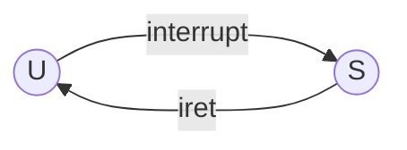
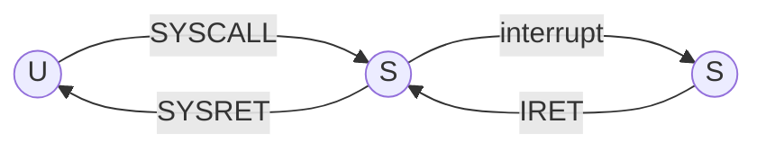

Affinchè il sistema operativo funzioni la pila usata durante il funzionamento del [[modo]] S deve essere diversa da quella usata durante il funzionamento del modo U

## sPila e uPila
Rispettivamente pila del modo S e del modo U, e lo stack pointer deve essere cambiato adeguatamente al modo attivo, quindi esistono due stack pointer, USP e SSP.

---
 
 
## U -> S

Nel cambio da modo U a modo S dobbiamo commutare la pila **prima** del salvataggio di informazioni:
- L'indirizzo di ritorno a modo U deve essere salvato su sPila
- Nel ritorno da S ad U l'indirizzo di ritorno sarà prelevato da sPila (prima di commutare ad uPila)

User stack pointer e System stack pointer due strutture dati ad accesso hardware nella memoria S:
- SP al momento del passaggio U -> S deve essere salvato in USP (SP -> USP)
- SSP contiene il valore del puntatore alla sPila da caricare in SP al momento del passaggio dal modulo S

## Commutazione di pila con [[SYSCALL]] e [[SYSRET]]
SYSCALL:
- Salva SP corrente in USP | cambio pila  
- Salva SSP in SP  | cambio pila  
- Salva RA in sPila  | push  
- Salva PSR del chiamante (in modo U) su sPila | push 
- Carica in PC e PSR i valori del [[vettore di syscall]]

SYSRET:
- Carica in PSR il PSR(u) presente in sPila (torna ad essere modo U)  | pop 
- Carica in PC il valore dell'RA su sPila   | pop 
- Carica in SP il valore presente in USP (sp punta ad uPila)  | cambio pila  

# [[Interrupt]] ed [[IRET]]

## CASO 1
L'interrupt interrompe un processo U

L'interrupt:
- Salva SP in USP (ora USP punta ad uPila)
- Salva SSP in SP (ora SP punta a sPila)
- Salva su sPila il return address del programma interrotto
- Salva su sPila il PSR del programma interrotto (modo U)
- Carica in PC e PSR i valori del [[vettore di interrupt]] (il modo di funzionamento passa ad S)

L'IRET:
- carica in PSR il valore di PSR presente in sPila
- carica in PC il valore dell'indirizzo di ritorno al programma interrotto presente in sPila
- Carica in SP il valore presente in USP (SP punta nuovamente ad uPila)

## CASO 2
L'interrupt interrompe il [[sistema operativo]]

Interrupt:
- Salva su sPila l'indirizzo di tirò o al codice di sistema interrotto
- Salva su sPila il valore del PSR del codice di sistema interrotto (modo S)
- PC e PSR caricati dal [[vettore di interrupt]]

IRET:
-  Carica in PSR il valore del PSR presente in sPila
- Carica in PC il valore dell'indirizzo di ritorno al codice di sistema interrotto presente in sPila

>[!important]
Le ipotesi fatte fino ad ora falliscono considerando la [[processo#sPila dei processi]]

