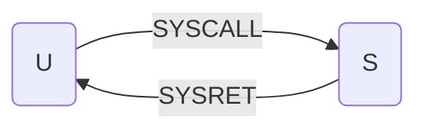

L'istruzione SYSCALL è un'istruzione [[x64#Modo utente / modo supervisore|non privilegiata]] che consente ad un processo in modo U di invocare un servizio del SO e passare in modo S. Ossia esegue un salto ad una funzione del [[sistema operativo]] che invoca il servizio di sistema richiesto.

Syscall esegue:
1. Valore del [[program counter|PC]] incrementato viene salvato nella pila come return address del programma che ha invocato la SYSCALL (PUSH PC)
2. Il contenuto del [[Process status register]] salvato sulla pila (PUSH PSR)
3. Vengono caricati in PC e PSR o valori rispettivi presenti in una struttura dati ad accesso hardware detto **[[vettore di syscall]]**

Per ritornare dalla SYSCAL si utilizza [[SYSRET]]

