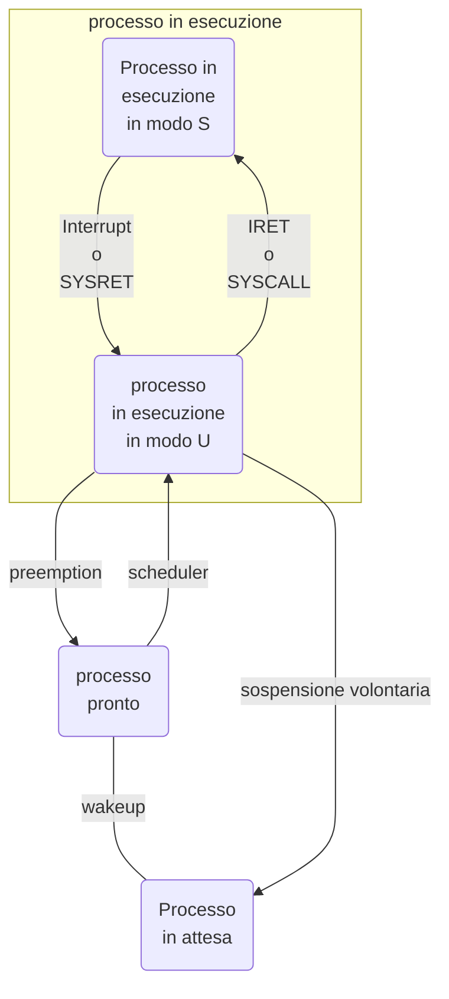

Un processo è un "calcolatore virtuale", ossia calcolatori realizzati attraverso il sistema operativo.

>[!def]
>Un istanza di un programma in esecuzione, identifiicato da un [[PID]] (process ID)

Tutti i processi sono creati da altri processi, allora tutti i processi hanno un processo padre ad esclusione di "init" che è avviato con il sistema operativo.

La [[memoria]] di ogni processo è divisa in [[segmenti]], questo non dipende strettamente dal numero di processori utilizzati per il processo, in caso di un solo processore time sharing.

Per gestire i processi usiamo le [[system call]]

## Carateteristiche di un processo
Ogni progesso ha: 
1. **text segment** che coniente il codice eseguibile del programma
2. **user data segment** che contiene i dati del programma (dati statici e dati dinamici a loro volta divisini in dati dinamici in pila e dati dinamici in heap)
3. **system data segment** che contiene dati gestiti dal sistema operativo (ad esempio le tabelle della pagine)


# Contesto di un processo
Normalmente un processo è in esecuzione in modo U, se il processo corrente richiede un servizio di sistema viene attivata tramite [[SYSCALL]] una funzione del [[sistema operativo]] che esegue il servizio per il processo chiamante.
Un processo è in esecuzione in [[modo]] S quando il Sistema operativo è in esecuzione nel contesto di tale processo, o per una SYSCALL o per un [[Interrupt]].

>[!DEF]
>Contesto di un processo si intende l'[[insieme]] di informazioni relative ad ogni processo che il Sistema operativo deve mantenere.

# Stato di un processo
- Esecuzione: è il processo che utilizza il processore (processo corrente)
- Pronto: Può essere mandato in esecuzione al processore se eventualmente selezionato dallo [[scheduler]]
- Attesa: un processo è in attesa se non si può mandare in esecuzione perchè sta attendendo un evento (ad esempio un input dell'utente)


>[!esempio]
>
>```mermaid
>graph TB
>	A(processo </br>in esecuzione) --->|preemption| B(processo</br>pronto) 
>	B <---|wakeup| C(Processo</br>in attesa) 
>	A --->|sospensione volontaria| C
>	B --->|scheduler| A
>```


## esecuzione $\to$ pronto
Al termine del quanto di tempo il sistema operativo deve salvare tutte le informazioni necessarie (contesto) per poter riprendere l'esecuzione del processo dal punto in cui è stata interrotta

## esecuzione $\to$ attesa
Quando un servizio di sistema richiesto dal processo deve porsi in attesa di un evento (come un input utente) per poter riprendere l'esecuzione del processo dal punto in cui è stata interrotta

## attesa $\to$ pronto
Quando l'evento atteso da un processo si verifica il sistema operativo sposta tutti i processi in attesa di quell'evento o di quella risorsa nella coda dei processi pronti

## pronto $\to$ esecuzione
Lo scheduler del sistema operativo stabilisce quale dei processi accodati nello stato di pronto debba essere mandato in esecuzione **(caricamento del contesto)**


Quindi
>[!oss]
>Un processo di stato di esecuzione abbandona il processo:
>- o per l'attesa di un evento
>- o per il termine del quanto di tempo


In realtà l'esecuzione è l'unione di due stati:



# sPila dei processi

Ogni processo ha un sPila costituita da 2 [[pagina|pagine]] (8Kb), questo fa diventare i meccanismi di gestione dei la pila molto più complessi rispetto a quanto visto in [[Linux#Commutazione di pila]]. 

Dobbiamo salvare i valori di SSP e USP durante la sospensione tra un'esecuzione e la successiva.
Quindi il descrittore di un processo P conterrà due campi:
- sp0: contiene l'indirizzo di base della sPila di P
- sp: contiene il valore dello SP salvato al momento in cui il processo ha sospeso l'esecuzione

Quando P è in esecuzione in modo U, la sPila di P è vuota, ssp contiene l'indirizzo base della sPila di P preso dal campo sp0 del descrittore di P, quando la CPU passa al modo S è necessario eseguire subito la commutazione da uPila a sPila

## Gestione del /[[context switch]], salvataggio di contesto

Se durante l'esecuzione di un processo in modo S viene eseguita una commutazione di contesto linux esegue il [[salvataggio di contesto]]
- Salva il RA system call in esecuzione sulla sPila di P
- Salva USP sulla sPila di P
- salva il valore del registro SP nel campo sp del descrittore di P

SSP non deve essere salvato perchè punta ad sp0 già presente nel descrittore di P.

Quando P riprenderà l'esecuzione Linux esegue il [[ripristino di contesto]]

- SP caricato dal campo sp del descrittore di P, puntando al top della sPila di P
- SSP caricata dal campo sp0 del descrittore di P puntando alla base della sPila di P
- USP caricato dalla sPila di P
- PC caricato dal RA presente in sPila di P