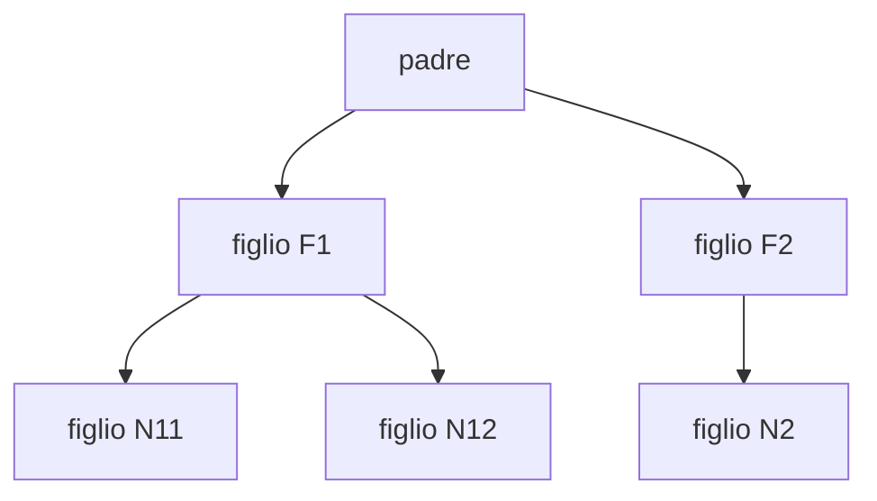

Per gestire i processi usiamo le system call (o primitive)

# [[Fork]]
Genera una gerarchia (o albero genealogico) dei processi a partire da #init, aggiungendo processi figli ai processi detti "padri"



F1 e F2 sono anche "padri" di N11, N12 e N2, questo schema non chiarisce l'ordine delle fork.

Quando viene chiamata la funzione fork genera un processo figlio identico a quello del padre, duplicando il segmento dati e di sistema, quando avviene la fork parent e child sono uguali, tuttavia l'esecuzione può variare $\implies$ non possiamo sapere cosa avviene prima nelle due funzioni.

Cambia il valore restituito dalla fork: 
- Nel padre restituisce il PID del figlio o -1 in caso di errore
- Nel figlio restituisce 0


>[!C] PROTOTIPO FORK
>```c
>pid_t fork(void);
>```
>con `pid_t` tipo predefinito

>[!C] Esempio fork
>```C
>#include <stdio.h>
>#include <sys/types.h>
>
>void main(int argc, char* argv[])
>{
> 	pid_t pid;
> 	pid = fork()
> 	if (pid == 0)
> 	{
> 		printf("processo figlio\n");
> 		exit();
> 	}
> 	else
> 	{
> 		printf("processo padre\n");
> 		exit();
> 	}
>}
>```
>
>>[!oss]
>>Dopo la fork i due processi padre e figlio proseguiranno in parallelo, eseguendo la stessa porzione di codice sullo stesso stdoutput, l'ordine delle print sarà casuale


# [[Exit]]
Termina il processo corrente (che può terminare anche senza la chiamata ad exit)

>[!c]
>`void exit(int)`

# Getpid e Getppid
Ottiene il proprio PID (getpid) o il PID del parent (getppid)


>[!esempio] Fork-getpid
>
>>[!c]
>>```c
>>#include <stdio.h>
>>#include <sys/types.h>
>>
>>void main()
>>{
>>	pid_t pid;
>>	printf("prima della fork: PID = %d", getpid());
>>	pid = fork();
>>	if (pid == 0)
>>	{
>>		prinft("figlio: PID = %d" getpid());
>>		printf("figlio: pid del padre = %d",getppid());
>>		exit();	
>>	}
>>	else
>>	{
>>		printf("padre: pid = %d", getpid());
>>		printf("padre: pid figlio = %d",pid);
>>		exit();
>>	}
>>}
>>``` 


# Wait e waitpid
sospende l'esecuzione del processo e attende che termini qualsiasi figlio, se un figlio termina prima che il padre esegue la wait,f la wait è istantanea

>[!c]
>`pid_t wait (int*)`
>Restituisce il pid del figlio terminato, e riceve il codice di terminazione del figlio (tramite indirizzo della variabile) * 256


>[!esempio] fork-wait
>>[!c]
>>```c
>>void main()
>>{
>>	pid_t pid;
>>	int stato_exit, stato_wait;
>>
>> pid = fork();
>> if (pid == 0)
>> {
>> 	printf("processo figlio con pid: %d", getpid());
>> 	stato_exit=5;
>> 	exit(stato_exit);
>> }
>> else
>> {
>> 	printf("generato processo figlio con pid %d", pid);
>> 	pid = wait(&stato_wait);
>> 	printf("terminato il processo figlio %d con esito %d",pid, stato_wait/256)
>> }
>>}
>>```


## waitpid
La `waitpid` aspettta un processo specifico specificandogli il pid del processo che attendiamo.
`waitpid - 1` aspetta la terminazione di tutti i figli
## Processo zombie
Se il figlio termina e il padre non ha ancora chiamato la wait si parla di processo zombie, la wait ritorna immediatamente ed il processo zombie viene terminato. (quindi lo stack rimane occupato)


# [[Exec]] o Execl

Sostituisce il programma in esecuzione, spesso è in combinazione con la fork (fork exec), non cambia il pid ma non esegue più il codice del padre ma un altro codice (dobbiamo dirgli quale funzione eseguire). Commutazione del codice, sostituisce il segmento del codice ed il segmento dati del processo corrente con codice e dati specificati da un eseguibile.
Il segmento di sistema non viene sostituito, **il processo rimane lo stesso**, quindi mantiene il pid.

Inoltre passa i parametri `argc` e `argv`.

>[!multi-column] fork-exec
>
>>[!C] main1
>>```C
>>#include <stdio.h>
>>
>>void main(int argc, char* argv[])
>>{
>>	int i;
>>	printf("programma main1 esecuzione");
>>	printf("ricevuto %d parametri", argc)
>>	for (i = 0; i < argc; i++)
>>	{
>>		printf("parametro %d e: %s\n",i,argv[i]);	
>>	}
>>}
>>```
>
>>[!C] forkexec1
>>
>>```C
>>#include <stdio.h>
>>#include <sys/types.h>
>>
>>void main(int argc, char* argv[])
>>{
>>	pid_t pid;
>>	int stato_wait;
>>	char P0[] = "main1";
>>	char P1[] = "param1";
>>	char P2[] = "param2";
>>	pid = fork();
>>	if (pid == 0)
>>	{
>>		printf("forexc1 in esecuzione");
>>		printf("lancio in esecuzione main1");
>>
>>	exec1("esempi/main1",P0,P1,P2,NULL);
>>	exit();
>>	}
>>	else
>>	{
>>		wait(&stato_wait);
>>		printf("processo figlio terminato");
>>		exit()
>>	}
>>}
>>```


```c
fork();
if pid == 0
	exec(...);
```