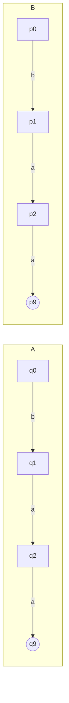
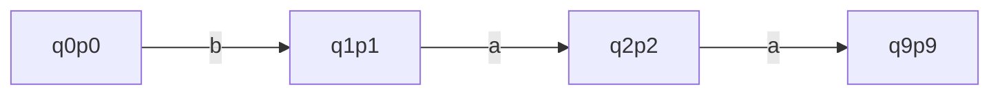

Vogliamo costruire un automa a stati finiti che simuli entrambi gli automi


risolviamo accoppiando




>[!esempio] Esempio intersezione
>```mermaid
>graph LR
>  i_s ---> s0
>  i_t ---> t0
>	subgraph S
>	s0 --->|a| s1
>	s1 --->|b,c| s0
>	s0 --->|a| s0((s0))
>	s1 --->|b,c| s1
>	end
>	subgraph T
>	t0 --->|b| t1
>	t1 --->|a| t0
>	t0 --->|c| t0
>	t1--->|c|t1
>	end
>
>```
>Allora s0t0 è
>```mermaid
>graph TB
>	i --> s0t0
>	s0t0(( s0t0)) -->|c| s1t0 -->|b| s1t1 --> |c|s0t1 -->|a| s0t0
>	s0t0 -->|b| s1t1
>	s1t1 -->|a| s0t0
>	s1t1 -->|c| s1t1
>	s1t0 -->|c| s1t0
>
>```


In modo formale:

Dati $A = <Q^1,I,\delta,q_{0}^1,F^1>$ e $A^2 = <Q^2,I,\delta^2,q_{0}^2,F^2>$
$<A^1,A^2> = <Q^1 \times Q^2, I, \delta, <q_{0}^1,q_{0}^2>,F^1 \times F^2>$
$\delta(<q^1,q^2>,i)= <\delta^1(q^1,i),\delta^2(q^2,i)>$

ATtraverso una semplice induzione 
 $$
L(<A^1,A^2>) = L(A^1) \cap L(A^2)
$$

Possiamo sfruttare la stessa costruzione per l'[[Unione]], tuttavia con delle difficoltà 