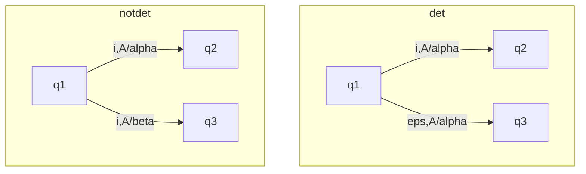

![[Automa a pila.canvas]]


Diamo la possiblità agli [[Automa a stati finiti|FAS]] di scrivere in nastri di scrittura e di leggere da nastri di lettura, quindi potranno fare mosse in funzione di:
- Simbolo letto dal nastro di lettura
- Simbolo letto dalla pila
- Stato dell'organo di controllo:
	- Cambia stato
	- Sposta di una posizione la testina di lettura
	- Sostituisce al simbolo A una stringa $\alpha$
	- Se [[Traduttore]] scrive una stringa nel nastro di uscita

Non sono necessariamente real time, puó decidere di sospendere le operazioni per lavorare sulla pila.

La stringa di ingresso $x$ viene riconosciuta se
 - L'automa la scandisce completamente
 - Giunto alla fine di $x$ si trova in uno stato di accettazione come l'[[Automa a stati finiti]]

Inoltre se l'automa è pure traduttore
$\tau(x)$ è la stringa che si trova nel nastro di scrittura dopo aver scandito totalmente $x$, (se $x$ non viene accettata $\tau(x) = \perp$ , $\perp$ significa indefinito) 

>[!esempio]
>Riconoscimento della stringa $a^nb^n$
>```mermaid
>graph LR
>q0
>```
>
>
>

Possiamo sfruttare la pila per leggere le stringhe di tipo $a^nb^n$, 


# Automa traduttore a pila
![[Pasted image 20230223095250.png]]


>[!def]
>Automa traduttore a pila: $<Q,I,\Gamma, \delta, q_{0},Z_{0},F[, O, \eta]>$
>
>$Q, i,q_{0}$ ed $F[O]$ come per gli [[Automa a stati finiti|FSA]]
>$\Gamma$ alfabeto di pila
>$Z_{0}$ simbolo iniziale di pila
>$\delta: Q \times (I \cup \left\{ \varepsilon \right\})\times \Gamma \to Q \times \Gamma^*$, osserviamo che $\delta$ è parziale
>$\eta: Q \times (I \cup  \left\{ \varepsilon \right\}) \times \Gamma \to O^*$, osserviamo che $\eta$ è definita dove $\delta$ è definita.
>
> [[push]] -> $<p,\alpha> =\delta(q,I,A)$
> [[pop]] -> $w = \eta(q,I,A)$
>
>```mermaid
>graph LR
>	A(q) --->|i,A/alpha,w| B((p))
>```


![[Configurazione]]

$$
\begin{align}
x &\in L \\
&\leftrightarrow  \\
c_{0} = <q_{0},x,Z_{0},[\varepsilon]> \vdash^* c_{F} &= <q,\varepsilon,\gamma,[z]>, q \in F
\end{align}
$$


I linguaggi di programmazione reali sono tutti basati su automi a pila, memoria a pila LIFO adatta ad analizzare strutture sintattiche nestate


# Proprietà degli automi a pila

1. $a^nb^n$ riconoscibile da un automa a pila, tuttavia $a^nb^nc^n$ non lo è, infatti contiamo prima le $a$, poi contiamo le $b$ eliminando il contenuto della pila tramite [[pop]], a questo punto non abbiamo piú memoria di $n$ per contare $c$. Invece programmando è estremamente semplice fare un codice che riconosca questo linguaggio.

>[!warning]
>La memoria è degli automi a pila è distruttiva, va eliminata per essere letta (questo risultato deriva da un pampling lemma degli automi a pila)


2. $a^nb^n$ riconoscibile da un automa a pila
   $a^nb^{2n}$ riconoscibile da un automa a pila
   Peró consideriamo
   $$\left\{ a^nb^n | n > 0 \right\} \cup \left\{  a^nb^{2n} | n > 0\right\} $$
   abbiamo che:
	   - Se svuoto tutta la pila con $n$ b perdo memoria se ci sono altri b
	   - Se svuoto solo a metà e non trovo piú b non posso sapere se sono a metà pila

Quindi la classe dei linguaggi riconosciuti dagli automi a pila $LP$ non è [[Chiusura|chiusa]] rispetto all'intersezione e rispetto all'unione

>[!oss]
>Questo non significa che non è mai possibile l'unione di linguaggi riconosciuti da automi a pila

>[!oss]
>$\mathcal{L}(AF) \subset \mathcal{L}(AP)$
>Si dimostra prima $\subseteq$ e poi che $\neq$, e si aggiunge poi una pila stupida a qualsiasi tipo di automa a stati finiti, ossia una pila che aggiunge e rimuove ad ogni passaggio, questo rende inalterato il FSA, per dimostrare che non è uguale è semplice

>[!oss]
>Il fatto che una classe sia sottoinsieme di un altra non implica che la seconda abbia piú proprietà

### Chiusura rispetto a $\neg$?
Come per i FSA, bisogna avere una fuzione di transizione totale e non parziale, dobbiamo arrivare in fondo ad ogni stringa.

Ciclo di epsilon mosse significa che lavora solo sulla pila, ma sono inutili. (Si possono eliminare), inoltre dobbiamo anche eliminare epsilon mosse alla fine, altrimenti se una stringa venisse accettata anche il suo complemento verrebbe accettato.

# Automi a pila non deterministici
Nascono non deterministici di natura, aggiungiamo noi il [[determinismo]]:



$\delta : Q \times (I \cap \left\{ \varepsilon \right\}) \times \Gamma \to \mathcal{P}_{F}(Q\times \Gamma^*)$

- L'indice $F$ sta per finito
- L'APND accetta $x$ se esiste una sequenza
- $c_{0} \vdash^* \left< q,\varepsilon,\gamma \right>, q \in F$
- $\vdash$ non è univoca!


>[!oss]
>Gli automi a pila non deterministici possono riconoscere un [[linguaggio]] non riconoscibile dagli automi a pila deterministici, quindi sono piú potenti.
>
>Hanno la chiusura rispetto all'[[unione]]
>
>Non hanno la [[chiusura]] rispetto all'[[intersezione]]
>
>il complemento non puó esserci per [[De morgan]]

$$
\mathcal{L}(APD) \subset \mathcal{L}(APN)
$$
Si dimostra:
- $\subseteq$
- $\neq$

