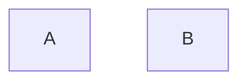
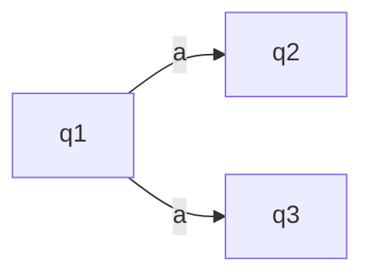

Detti anche FSA, sono macchine deterministiche con un insieme finito di stati:
{Acceso, Spento}, {1,2,3,4,...,k}, {on,off}

Che si possono cosí rappresentare:



>[!multi-column]
>
>>[!esempio]
>>```mermaid
>>graph LR
>> On -->|T| Off -->|T| On
>> 
>>
>>```
>
>>[!esempio]
>>```mermaid
>>graph LR
>>	On -->|R| Off -->|S| On
>>	On -->|s| On
>>	Off -->|R| Off
>>```


Quindi un automa a stato finito è costituito da:
- un insieme finito di stati $Q = \left\{ q_{1},q_{2},\dots,q_{n} \right\}$
- un insieme finito ([[Linguaggio|alfabeto]]) di ingressi 
- una [[funzione di transizione]] (parziale) $\gamma:Q \times I \to Q$

>[!esempio]
Possiamo rappresentarlo cosí:
>```mermaid
>graph LR
>	A --->|1| B
>	B --->|1| A((A))
>	A --->|0| A
>	B --->|0| B
>	i -..-> A
>```
>Abbiamo due stati che si scambiano per ogni 1 in ingresso e rimangono su se stessi se l'ingresso vale 0.
>L'ingresso i è in $A$ e termina su $A$ (indicato con il nodo circolare).
>In questo caso il linguaggio accettato è 
>L = {un numero pari di 1 ed un numero qualsiasi di 0}

definiamo una [[sequenza di mosse]] induttivamente tramite $\delta$ (funzione di transizione)

Un tipo notevole di automi FSA, sono gli automi traduttori

# Traduttori
![[Traduttore|traduttori]]

![[Ciclo]]


Visualizzamo meglio gli automi a stati finiti:

![[FSA.canvas]]
Possiamo aggiungere un ulteriore nastro detto pila, che funzionerà da memoria, questo tipo di automi si chiama [[Automa a pila]]


# Automa a stati finiti non deterministico


Formalmente $\delta(q_{1},a) = \left\{ q_{2},q_{3} \right\}$
$\delta : Q \times I \to \mathcal{P}(Q)$