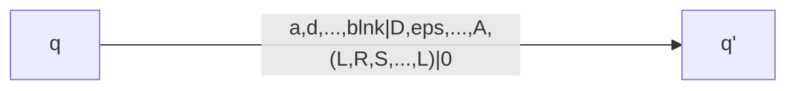

Ultimo automa che vedremo, introdotto alla fine della prima metà del '900 da Alan Turing.
È una macchina di bassissimo livello, è progettata per essere estremamente semplice, questo rende tuttavia molto piú complesso lavorarci sopra ("Programmare"), partiermo quindi con una variante leggermente piú complicata (che quindi renderà piú semplice lavorarci), deterministico

# Macchina di Turing a $k$-nastri

![[MT a k-nastri.canvas]]

È una generalizzazione dell'[[automa a pila]], su ogni nastro (infinito) c'è una testina, quindi puó lavorare su **elementi che non sono in cima alla pila**, puó leggere e scrivere in qualsiasi punto del nastro. 

- Movimenti della testina
	- S - STOP
	- L - LEFT
	- R - RIGHT


## Mossa della macchina di Turing
$$
\delta,[\eta]: Q\times I \times \Gamma^k \to Q \times \Gamma^k \times \left\{ R,L,S \right\}^{k+1}[\times O \times \left\{ R,S \right\} ] 
$$
con $\Gamma$ alfabeto di pila, notare che sono tanti quanti i nastri di memoria, prima indichiamo i k caratteri letti dai k nastri, e poi i k caratteri scritti dai k nastri.
$k+1$ Movimenti in quanto c'è anche il nastro in ingresso.

>[!oss]
>$S$ sul nastro di ingresso è una [[epsilon]] mossa, inoltre posso leggere piú volte il contenuto del nastro di ingresso.

Quindi:
- L'[[Automa a stati finiti]] può solo avanzare sull'ingresso
- L'[[Automa a pila]] può avanzare o stare fermo
- La macchina di turing può avanzare, stare ferma o tornare indietro

### Configurazione iniziale
- Sui caratteri non ancora inizializzati ci sono caratteri blank: $\cancel{ {b} }$
- $Z_{0}$ nella prima posizione nei nastri di memoria
- Nastro di uscita blank
- Testine nella posizione 0 di ogni nastro
- Stato iniziale $q_{0}$
- Stringa di ingresso $x$ dalla $0$ esima cella del nastro, seguita da blank


### Configurazione finale
-Stato di accettazione $F \subseteq Q$
- Per comodità: $\delta,[\eta] (\mathbf{q},\dots)=\perp \forall q \in F$
- La macchina si ferma quando $\delta,[\eta],(q,\dots) = \perp$
- La stringa $x$ di ingresso viene accettata se e solo se:
	- Dopo un numero finito di mosse la macchina si ferma (Si trova in una configurazione $\delta,[\eta],(q,\dots)= \perp$)
	- Lo stato $q$ in cui si trova quando si ferma $\in F$
- La stringa $x$ di ingresso **non** è accettata se avviene uno dei seguenti:
	- La macchina si ferma in uno stato $\ni F$
	- La macchina non si forma

----
>[!Esempio]
>Automa che riconosce $\left\{ a^nb^nc^n | n > 0 \right\}$
>Slide 88 #todo 

Negli automi a pila possiamo scrivere piú di un elemento in pila ad ogni mossa, per replicare questo comportamento sfruttiamo epsilon mosse

>[!esempio]
>Calcolo del successore di un numero codificato in decimali. S91
>
>- $M$ copia tutte le cifre di $n$ su $T$ alla destra di $Z_{0}$, cosi facendo sposta la testina di $T_{2}$ dello stesso numero di posizioni
>- $M$ scandisce le cifre di $T_{1}$ da destra a sinistram scrive in $T_{2}$ da destra a sinistra modificando opportunamente le cifre (i 9 diventano 0, la prim cifre diversa da 9 diventa la cifra successiva, le altre copiate uguali)
>- $M$ ricopia $T_{2}$ sul nastro di uscita
>
> #### Notazione
> - $: qualsiasi cifra decimale
> - \_: blank
> - \#: qualsiasi cirfa $\neq 9$
> - \^: il successore della cirfa denotata da # 
>  - <Input,T1,T2,Scrittura>


## [[Chiusura]]
Le macchine di turing possono simulare altre macchine di turing in modo molto semplice, quindi sono chiuse per unione ed intersezione.

### Simulazione in serie
Simulo prima una macchina e poi l'altra, è adatta per l'intersezione, infatti la prima macchina puó, andare in loop, accettare, o rifiutare, e tutti questi casi sono adatti per l'intersezione (non per l'unione, se andasse in loop non potremmo verificare la secondo macchina)

## Mosse di una macchina di turing

Prima lettura dei vari nastri, poi scrittura sui nastri e movimento delle testine, prima input, poi i k nastri, e poi eventualmente l'output

>[!esercizio]
>Progettare un MT a 1 nastro che accetti il linguaggio:
>$\mathcal{L} = \left\{ a^{(2^n)} | n \geq 0 \right\} = \left\{ a,aa,aaaa,a^8, a^{16},\dots \right\}$
>  Ossia dobbiamo riconoscere le potenze di due in base 1
> 1: divido per due
> 2: raddopiio e confronto
>Smart 3: converto in base 2 e controllo se  è in ($1.0^*$)

# Macchina di turing a nastro singolo
Macchina di turing "originale", è molto semplice, facile da studiare ma complessa da utilizzare.

![[MT nastro singolo.canvas]]
Il nastro unico funge da ingresso, da memoria, e da uscita.
Comandi:
- RIGHT - R
- LEFT - L
- STOP - S

Si ferma quando la funzoine di transizione la ferma, e il risultato dipende dallo stato a cui si ferma.
Per memorizzare una grande quantità di informazioni si lavora espandendosi ai lati dell'ingresso, creando dei nastri "virtuali", ed in effetti è cosí che si dimostra, usando dei limitatori per imitare la configurazione di un $k$-nastri. Emulazione.

# Macchina di Turing non deteriministica
$$
\delta, [\eta] : Q \times I \times \Gamma^k \to \mathcal{P}(Q \times \Gamma \times \left\{ R,L,S \right\}^{k+1} [\times O \times \left\{ R,S \right\} ]  )
$$
È necessario l'indice F (della configurazione finale)?
Configurazioni, transizioni, sequenze di transizioni e accettazione sono definite come al solito.
Infine chiediamoci se il non [[determinismo]] aumenta la potenza delle macchine di Turing.

> [!esempio] Albero delle computazioni
> ```mermaid
> graph TB
> 	c0 --> n0((.))
> 	n0 --> c11
> 	n0 --> c12
> 	n0 --> c13
> 	c11 --> c21
> 	c11 --> c22
> 	c21 --> c31((c31))
> 	c21 --> c32
> 	c32 -.-> n1((.))
> 	c22 --> n2[.]
> 	c12 --> c23
> 	c23 --> n3((.))
> 	n3 -.-> n5((.))
> 	c23 --> n4((.))
> 	c13 --> c24
> 	c24 -.-> n6((.))
> 	c13 --> c25 -.-> n7((.))
> 	c13 --> c26
> 	c26 --> ckj[ckj]
> 	c26 --> cim(cim)
> 	
> ```
> ```mermaid
> graph LR
> 	Ca[C di accettazione]
> 	Ch((C di halt))
> 	
> ```

E le linee tratteggate computazioni non terminate

>[!oss]
>L'albero di computazione di una macchina di turing (deterministica e non) puó: non fermarsi, fermarsi o accettare.
>
>Se la macchina è deterministica l'albero sarà lineare
>Se la macchina è deterministica l'albero sarà ramificato

Una stringa $x$ è accettata da una macchina di Turing non deterministica se e solo se esiste una computazione della MND che termina in uno [[stato]] di accettazione.
Quindi dobbiamo analizzare l'albero e trovare uno stato di accettazione

La domanda è, puó una macchina di Turing deterministica stabilire se una sua sorella non deterministica accetta $x$. Ossia accettare $x$ se e solo se la non deterministica la accettta?
Per farlo dobbiamo percorrere l'albero delle computazioni non deterministiche per stabilire se esiste in esso un cammino che termina con uno stato di accettazione, è un normale e ben noto problema di visita di alberi per il quale esistono algoritmi appositi, dobbiamo quindi implementare un algoritmo di visita di alberi attraverso maccchina di turing.

In realtà un problema sorge se vi sono nell'albero computazioni che non terminano, ad esempio un algoritmo di visita in profondità in preordine sinistro potrebbe infilarsi in un cammino infinito senza scoprire che in un altro punto dell'albero ne esist euno finito che porta all'accettazione. Si risolve facilmente adottanto un palgoritmo di vista in ampiezza; usa una struttura a coda invece di una a pila per accumulare i vari nodi da esaminare.


