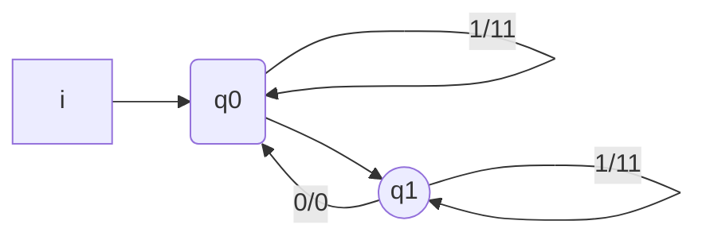

Il traduttore è un automa, un[[Modelli operazionali|modello operazionale]] che legge una stringa e la traduce

$\tau$ ogni due $0$ ne riscrive $1$ e ogni $1$ se ne scrivono 2, gli 0 devono essere pari

x = 1010 
y = 11110 (termina a q0)

Se per esempio aggiungiamo uno 0
x = 10100 
y = $\perp$ (termina a q1)

>[!def]
>- T = <Q,I,$\delta$,q0,F,O,$\eta$>
>	- <Q,I,$\delta$,q0,F> come per $A$ riconoscitore
>	- O: alfabeto di uscita
>	- $\eta : Q \times I \to O^*$
>
>- $\eta^* : Q \times I^* \to O^*$
>$\eta^*(q,\varepsilon) = \varepsilon$
>$n^*(q,y.i) = \eta^*(q,y).\eta(\delta^*(q,y),i)$
>
>- $\tau(x) = \eta^*(q_{0},x) \iff \delta^*(q_{0},x) \in F$
>  
> $\eta$ traduce una carattere
>$\eta^*$ traduce una stringa (induttivamente)

