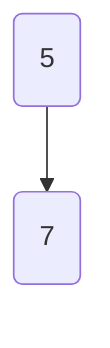

L'idea alla base di Heapsort è che un array si può interpretare come un albero binario
- $A[i]$ è la radice
- Per ogni elemento $A[i], A[2i]$ e A$[2i + 1]$ sono i suoi figli e $A[\lfloor i / 2 \rfloor]$ è il papdre

 
 | pos  | 1   | 2   | 3   | 4   |
 | ---- | --- | --- | --- | --- |
 | elem | 5   | 7   | 2   | 1    |

