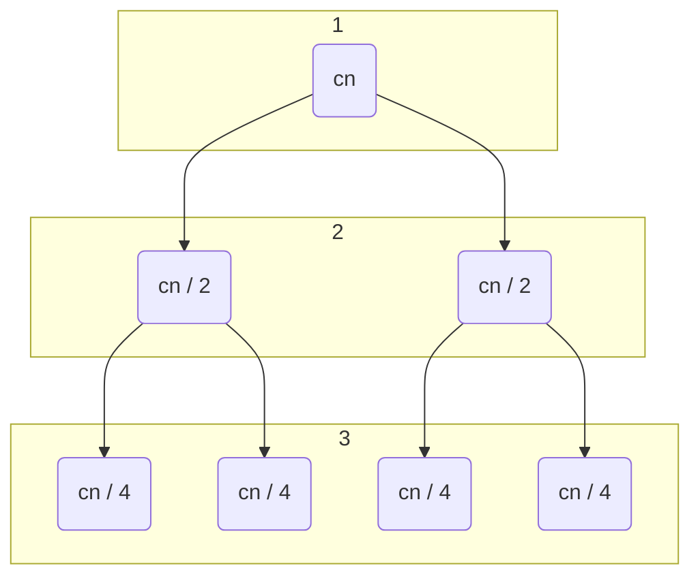

>[!def] [[Merge]]-sort(A, p, r)
>```clike
>if p < r
>	q := floor( ( p + r ) / 2 )
>	merge-sort(A, p, q)
>	merge-sort(A, q + 1, r)
>	merge(A, p, q, r)
>```


Per ordinare un array `A = [A[1], A[2],...,A[n]]` usiamo `merge-sort(A, 1, A.length)`

>[!tldr]
>Se l'array ha meno di due elementi
>	è già ordinato
>Altrimenti:
>	1. Si divide l'array in due sottoarray
>	2. Si ordinano i due sottoarray riapplicando l'[[algoritmo]]
>	3. Si fondono (merge) i due sottoarray (che ora sono ordinati)

Merge-sort è un algoritmo [[ricorsivo]]

## Complessità
Abbiamo una riccorrenza tipica di un [[algoritmi divide et impera|algoritmo divide et impera]], quindi abbiamo
$D(n) = \Theta(1), a,b = 2, C(n) = \Theta(n)$

In realtà non stiamo tenendo conto del caso in cui $n$ sia [[dispari]], in cui si ha $T(n) = \lfloor T(n / 2) \rfloor + \lceil T(n / 2)\rceil$
Ma l'approssimazione non influisce sul comportamento [[asintotico]].

Ora dobbiamo risolvere la ricorrenza, partiamo dal fondo, $T(1) = \Theta(1)$ facciamo solo il controllo, quindi:
$$T(n) = \Theta(1) + T(n / 2) + T (n / 2) + \Theta(n) = 2T(n / 2) + \Theta(n)$$

Possiamo risolvere la ricorrenza sfruttando l'[[albero di ricorsione]]:
- Quando chiamo merge-sort ho un array A tale che $|A| = n$


Sum 1 = cn
sum 2 = cn
sum 3 = cn
sum ...


Quindi il totale è $\log_{2}(n) + cn$
Quindi la [[complessità]] totale è $\Theta(n \log_{2}(n))$

>[!oss]
>Non c'è un caso ottimo ed un caso pessimo, inoltre ha un alta complessità spaziale dovendo generare nuovi array

Questo è uno dei molteplici casi di [[soluzioni di ricorrenze]]