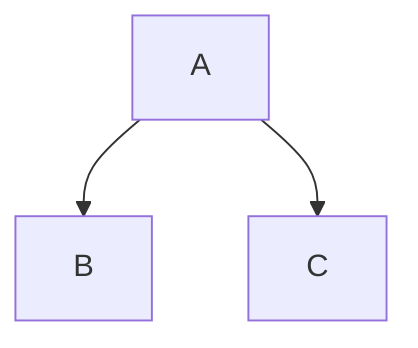
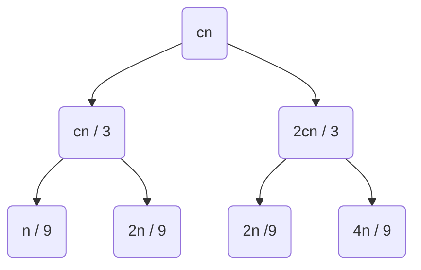

È un metodo meno preciso ma permette di fare una congettura da verificare con il metodo di sostituzione.
A partire dalla ricorrenza, sviluppiamo l'albero delle chiamate, indicando per ogni chiamata la sua complessità.

>[!esempio]
>$T(n) = T(\lfloor n / 3 \rfloor) + T(\lfloor  2n / 3 \rfloor) + O(n)$


Prima chiamata


Espandiamo



A sinistra il percorso piú corto, di lunghezza $\log_{3}(n)$
A destra il percorso piú lungo, di lunghezza $\log_{3/2}(n)$

L'albero avrà questa forma:
```tikz
\begin{document}
\begin{tikzpicture}[scale = 2]
\draw (0,0) -- (-1,-1) -- (2.5,-2.5) -- (0,0);
\draw[red, fill = red, fill opacity = 0.2] (0,0) -- (-1,-1) -- (1,-1) -- (0,0);
\draw (3, -2.5) -- (3, 0) node[midway, left]{$\log_{3 / 2}(n)$};
\draw (-1.5,-1) -- (-1.5,0) node[midway, right]{$\log_3(n)$};
\end{tikzpicture}
\end{document}
```


$T(n) = \Omega(n \log_{3}(n))$
$T(n) = O(n \log_{3 / 2}n)$
