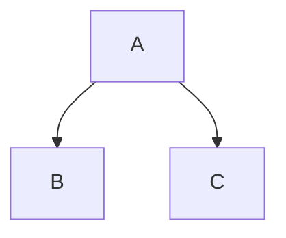

È un metodo meno preciso ma permette di fare una congettura da verificare con il metodo di sostituzione.
A partire dalla ricorrenza, sviluppiamo l'albero delle chiamate, indicando per ogni chiamata la sua complessità.

>[!esempio]
>$T(n) = T(\lfloor n / 3 \rfloor) + T(\lfloor  2n / 3 \rfloor) + O(n)$


Prima chiamata


Espandiamo

```mermaid
graph TB
	A --> B (cn)
	A --> C (cn / 3)
	B --> B1 ()
	B --> B2
	C --> C1
	C --> C2
```


