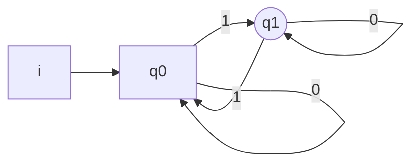
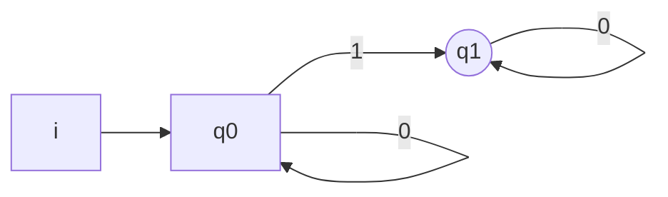
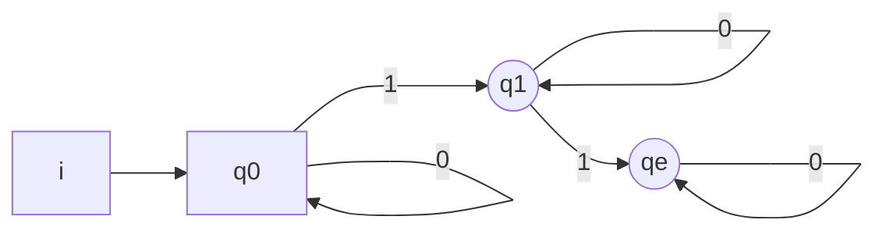

$$A \cup B = \neg(\neg A \cap \neg B) $$

Che diventerebbe

quanti zeri vogliamo, ed **un solo uno** a differenza di quello precedente che poteva accettarne infiniti, in questo caso $\delta$ è parziale, ed abbiamo quindi un problema, manca il collegamento, risolviamo aggiungendo un caso di errore:

Otteniamo cosí un automa con [[funzione di transizione]] totale