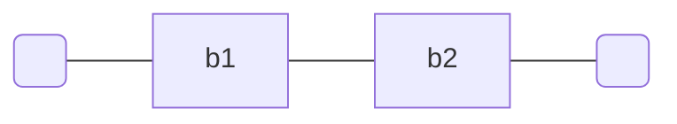

# Connessione in serie

Due bipoli si dicono in serie se hanno un nodo in comune che connette solamente i lati dei due bipli



se le loro [[equazione costitutiva | equazioni costitutive]] sono $v_1 = f_1(i_1)$ e $v_2 = f_2(i_2)$, l'equazione costitutiva del [[bipolo]] equivalente è $v  = f_1(i_1) + f_2(i_2)$, infatti i bipoli sono attraversati dalla stessa [[corrente]] $i_1 = i_2$ e v è necessariamente $v_1 = v_2$

Dalla connessione in serie deriviamo il [[partitore di tensione]]

## Connessione in serie di condensatori
$V = \sum V_{i}$
$I_{i} = C_{i} \frac{d}{dt}V_{i}$
$\frac{d}{dt} V_{i} = \frac{I_{i}}{C_{i}}$
$\frac{dV}{dt} = \sum \frac{I_{i}}{C_{i}} = I\sum \frac{1}{C_{i}} \implies I = \frac{dV}{dt} \cdot \sum\frac{1}{\sum 1/c_i}$

## Connessione in serie di induttanze
Analogo alle resistenze
$L_{eq} = \sum L_{i}$

## Connessione in serie di impedenze
>[!example]
>Dati un [[condensatore]], induttore e resistoer connessi in serie
>![[Pasted image 20220607120455.png]]
è banale che $\overline{v} = \overline{v}_R + \overline{v}_C +\overline{v}_L$
$$\overline{v} = R\overline{i} + \frac{1}{j\omega C}\overline{i} + j\omega L \overline{i}$$
>

E quindi
>L'impedenza equivalente ad M impedenze $Z_k(j\omega)$ è pari alla somma delle M impedenze, ossia $Z_{eq}(j\omega) = \sum_{k=1}^M Z_k(j\omega)$

Notiamo come possiamo scrivere l'equazione dell'esempio.
$$Z_{eq}(j\omega) = R + j\left(\omega L - \frac{1}{\omega C}\right)$$

Dove la parte immaginaria si annulla per $\omega = \omega_R = \frac{1}{\sqrt{CL}}$, detta [[pulsazione di risonanza]], a questa pulsazione il bipolo equivalente è un resistore R.

# ANKI
```anki
id: 1695223919068
deck: Elettrotecnica
---
# Serie
===
Se in due bipoli scorre la stessa corrente si parla di configurazione in serie.

$n$ resistenze in serie formano una resistenza equivalente con valore uguale alla somma delle $n$ resistenze.

$n$ condensatori in serie hanno capacità equivalente $C_{eq}= \frac{1}{\sum 1/c_i}$ 

$n$ induttanze in serie hanno capacità equivalente $L_{eq} = \sum L_i$
```


```anki
deck: Elettrotecnica
---
Connessione in serie di impedenze
===
L'impedenza equivalente ad M impedenze $Z_k(j \omega)$ in serie è pari alla somma delle M impedenze:
$$ Z_{eq}(j\omega) = \sum_{k = 1}^{M} Z_{k}(j \omega) $$
```


