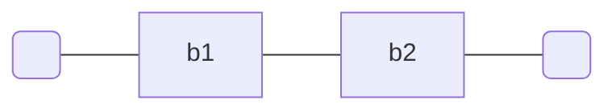

# Connessione in serie

Due bipoli si dicono in serie se hanno un nodo in comune che connette solamente i lati dei due bipli

se le loro [[equazione costitutiva | equazioni costitutive]] sono $v_1 = f_1(i_1)$ e $v_2 = f_2(i_2)$, l'equazione costitutiva del [[bipolo]] equivalente è $v  = f_1(i_1) + f_2(i_2)$, infatti i bipoli sono attraversati dalla stessa corrente $i_1 = i_2$ e v è necessariamente $v_1 = v_2$

Dalla connessione in serie deriviamo il [[partitore di tensione]]

## Connessione in serie di impedenze
>[!example]
>Dati un condensatore, induttore e resistoer connessi in serie
>![[Pasted image 20220607120455.png]]
è banale che $\overline{v} = \overline{v}_R + \overline{v}_C +\overline{v}_L$
$$\overline{v} = R\overline{i} + \frac{1}{j\omega C}\overline{i} + j\omega L \overline{i}$$
>

E quindi
>L'impedenza equivalente ad M impedenze $Z_k(j\omega)$ è pari alla somma delle M impedenze, ossia $Z_{eq}(j\omega) = \sum_{k=1}^M Z_k(j\omega)$

Notiamo come possiamo scrivere l'equazione dell'esempio.
$$Z_{eq}(j\omega) = R + j\left(\omega L - \frac{1}{\omega C}\right)$$

Dove la parte immaginaria si annulla per $\omega = \omega_R = \frac{1}{\sqrt{CL}}$, detta [[pulsazione di risonanza]], a questa pulsazione il bipolo equivalente è un resistore R.
