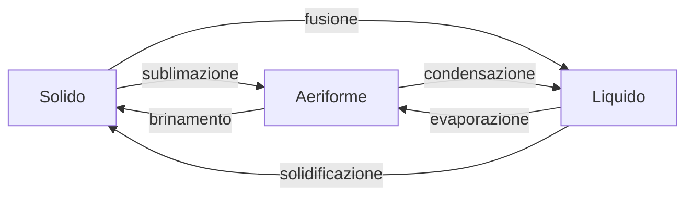

>[!oss]
>i cambiamenti di fase avvengono a [[temperatura]] costante, il corpo che cambia fase assorbe o cede [[calore]] senza ambiare temperatura, ma cambiando la propria struttura.
>Durante i cambiamenti di fase si introduce il [[calore latente]]


```tikz
\begin{document}
\begin{tikzpicture}
\draw(0,0) -- (4,0)node[right]{Q};
\draw(0,0) -- (0,3)node[left]{T};
\draw(0,0) -- (1,1) -- (3,1) -- (4,2);
\draw(1,0) -- ++ (0,0.1);
\draw(3,0) -- ++ (0,0.1);
\node[scale = .8] at (2,-.2) {cambiamento di fase};
\end{tikzpicture}
\end{document}
```

# ANKI

```anki
id: 1705831178052
deck: Fisica
---
cambiamenti di fase
===
Solido -> liquido: fusione
Liquido -> solido: solidificazione
Liquido -> gassoso: evaporazione
Gassoso -> liquido: condensazione
solido -> gassoso: sublimazione
gassoso -> solido: brinamento

I cambiamenti di fase avvengono a temperatura costante, assorbendo o cedendo calore per cambiare la propria struttura. Nei cambiamenti di fase si definisce il calore latente
```
