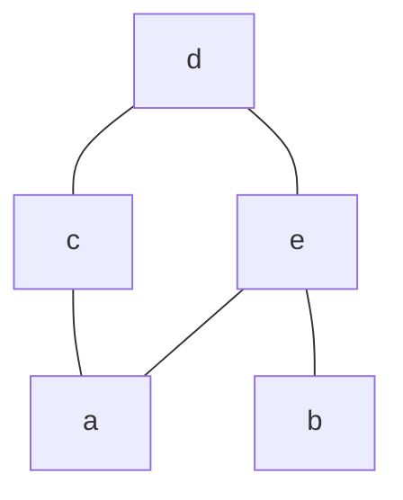

# 1
- Relazioni
	- matrice d'adiacenza
	- grafo di adiacenza
	- relazioni di equivalenza

# 2
- Relazioni
	- relazioni d'ordine

### 1.18

Data una [[relazione d'ordine]] su un insieme $A = \{ a,b,c,d,e \}$ tale che
$a \leq a, a \leq c, a \leq d, a \leq e$
$b \leq b, b \leq d, b \leq e$
$c \leq c, c \leq d$
$d \leq d$
$e \leq d, e \leq e$

è riflessiva, antisimmetrica e transitiva

disegniamo il [[diagramma di hasse]]

$x$ minimale se $y \leq x \implies x = y, \forall y$

'c' ed 'e' sicuramente non sono ne massimale ne minimale.
'b' non ha nessun elemento sotto di se, quindi è minimale
'a' non ha nessun elemento sotto di se, quindi è minimale
'd' non ha nessun elemento sopra, quindi è massimale

x è minimo se $x \leq y \forall y$.
Quindi 'a' e 'b' non sono minimi, infatti 'b' non è $\leq$ di 'c', mentre 'a' non è $\leq$ di 'b', quindi non è un minimo.
'd' invece è massimo per transitività. 

### 1.16
$R \subseteq \mathbb{N} \times \mathbb{N}$, $(n,m) \in R \iff n$ dispari e $\exists t \in \mathbb{N} \setminus \{ 0 \} \text{ pari } : n = m + t$
$S \subseteq \mathbb{N} \times \mathbb{N} : (n,m) \in S$ se $(n,m) \in R$ oppure $n = m$
