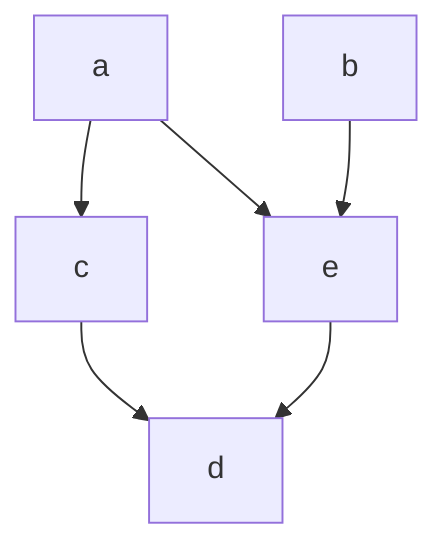

# 1
- Relazioni
	- matrice d'adiacenza
	- grafo di adiacenza
	- relazioni di equivalenza

# 2
Data una [[relazione d'ordine]] su un insieme $A = \{ a,b,c,d,e \}$ tale che
$a \leq a, a \leq c, a \leq d, a \leq e$
$b \leq b, b \leq d, b \leq e$
$c \leq c, c \leq d$
$d \leq d$
$e \leq d, e \leq e$

è riflessiva, antisimmetrica e transitiva

disegniamo il [[diagramma di hasse]]