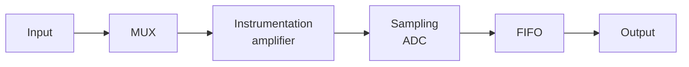

```mermaid
graph LR
	Input --> MUX --> IA[Instrumentation\n amplifier] --> SADC[Sampling\nADC] --> FIFO --> Output 
```

- [[MUX|multiplexer]] - permette di selezionare i diversi ingressi disponibili di tipo **single ended** e di tipo **differenziali**
- 
