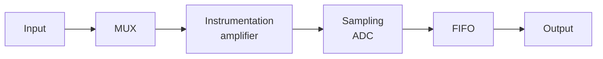

- [[MUX|multiplexer]] - permette di selezionare i diversi ingressi disponibili di tipo **single ended** e di tipo **differenziali**
- [[amplificatore per strumentazione]] - amplifica o attenua il segnale in ingresso mantenendo la stessa amplificazione/attenuazione a prescindere dalla frequenza del segnale d'ingresso (in base alla banda della scheda)
- [[campionatore ADC]] - convertitore analogico digitale che converte la tensione in un valore numerico (bit)
- Memoria FIFO - first in first out invia o sul bus dati del PC o direttamente in RAM (tramite DMA) del PC.

Inoltre hanno opzionalmente delle uscite analogica (DAC) di linee di I/O e di sincronizzazioni analogiche e digitali (timer e trigger)