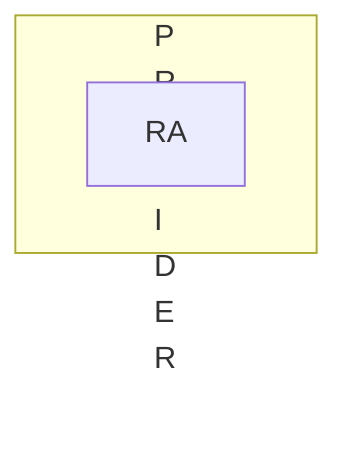

Associazione di Couchsurfing vuole eliminare utenti parassiti, richiede un sistema informativo.
Attraverso una app gli utenti devono offrire opsitalità:
- in una città
- in un certo periodo

guadagno di punti durante l'ospitazione.
L'associazione è piccolo quindi BI.
Customizzazione CMR ospitato sui server virtuali e supportato da un database appropiato.

Il forum va mantenuto ed integrato nel SI.

Le registrazioni a forum e app (componenti) siano condivise.

Offerte e app non saranno disponibili sul forum e viceversa.

Prospettiva di Business

Organizzazione -> Architettura -> Tecnologia ->  Business

Partiamo dall'organizzazione in quanto vogliono mandare via i clienti che se ne approfittano

# DPIVER
 | Aspetto      | valore                       | note                                   |
 | ------------ | ---------------------------- | -------------------------------------- |
 | partecipanti | customer2customer   (c2c) | associazione   di privati cittadini |
 | oggetti      | servizi                      | ospitalità                             |
 | tempo        | semi-dinamica                |                                        |
 | driver       | efficienza                   |                                        |

**controllare** i free-riders -> sistema informativo tattico

